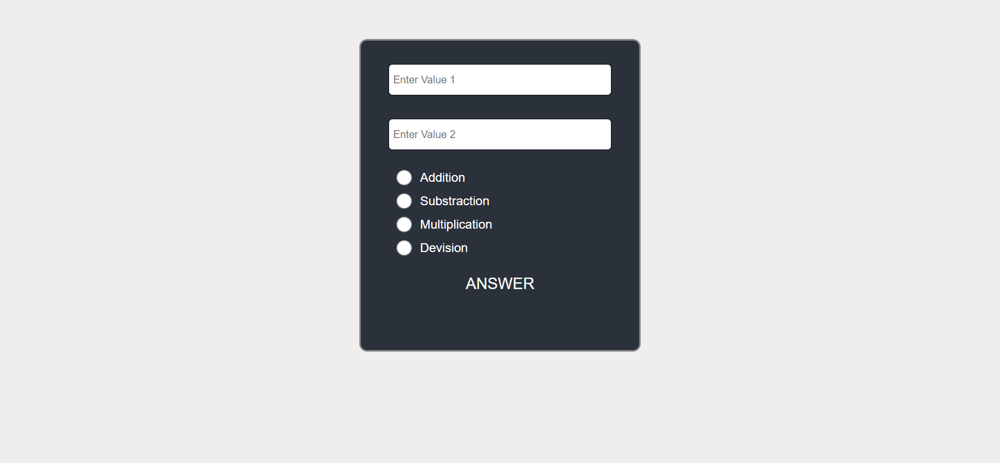

# 📁 Project Structure 

# 1. Simple Calculator :
● A straightforward calculator with basic operations like addition, subtraction, multiplication, and division.

● Input values and operators are handled using simple HTML form elements.

# 2. Simple Calculator with Dropdown Menu :
● An extended version of the simple calculator with a dropdown menu for selecting the operation.

● Provides a cleaner, more intuitive user experience.

# 3. Simple Calculator with Radio Buttons :
● Another variation using radio buttons for operation selection.

● Great for learning different ways to handle user input in forms.

# ✨ Key Features :
✅ Modular Code

✅ Responsive Design

✅ Interactive UI

✅ Beginner-Friendly

# 📸 Project Preview :
# 1. Simple Calculator

# 2. Simple Calculator with Dropdown Menu

# 3. Simple Calculator with Radio Buttons

